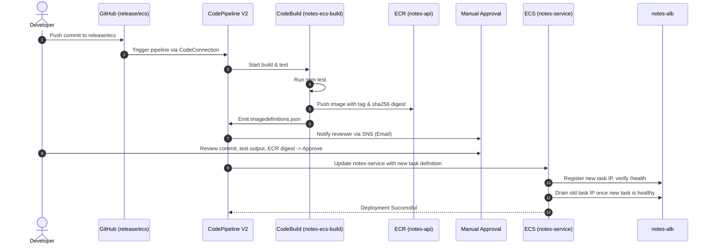
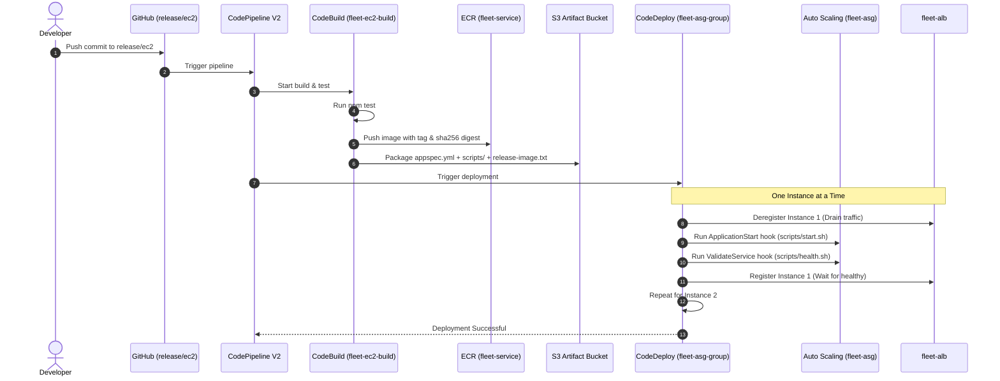

# AWS CI/CD Manual Setup Guide: GitHub to ECS Fargate & EC2 Auto Scaling
**Autumn 2026 Edition | Zero-Presupposition Walkthrough**

---

## 1. Overview & Architectural Contract

This guide provides an exhaustive, step-by-step manual setup for **two independent production-grade CI/CD pipelines** in AWS using the AWS Management Console and GitHub. 

Every single prerequisite—from application source code and unit tests to VPC networking, security groups, IAM JSON policies, load balancers, launch templates, and pipeline definitions—is built **from absolute scratch**. No prior resources or hidden configuration files are assumed.

```mermaid
flowchart TD
    subgraph TrackA ["Track A: ECS Fargate Rolling Pipeline (notes-ecs-pipeline)"]
        GA["GitHub: release/ecs"] --> CBA["CodeBuild: notes-ecs-build"]
        CBA -->|"Tests + Docker Build"| ECRA["Amazon ECR: notes-api (Digest Pinned)"]
        CBA -->|"imagedefinitions.json"| CPA["CodePipeline V2"]
        CPA --> APA["Manual Approval Gate"]
        APA --> DPA["Deploy: Amazon ECS (Rolling Update)"]
        DPA --> ECSA["ECS Fargate: production-cluster / notes-service"]
        ECSA --- ALBA["notes-alb (Target Group: ecs-notes-tg)"]
    end

    subgraph TrackB ["Track B: EC2 Auto Scaling CodeDeploy Pipeline (fleet-ec2-pipeline)"]
        GB["GitHub: release/ec2"] --> CBB["CodeBuild: fleet-ec2-build"]
        CBB -->|"Tests + Docker Build"| ECRB["Amazon ECR: fleet-service (Digest Pinned)"]
        CBB -->|"appspec.yml + scripts/ + release-image.txt"| CPB["CodePipeline V2"]
        CPB --> APB["Manual Approval Gate"]
        APB --> DPB["Deploy: AWS CodeDeploy (In-Place)"]
        DPB --> ASGB["Auto Scaling Group: fleet-asg (AL2023 Instances)"]
        ASGB --- ALBB["fleet-alb (Target Group: fleet-tg)"]
    end
```



### Pipeline Comparison Matrix

| Dimension | Track A: ECS Fargate (`notes-ecs-pipeline`) | Track B: EC2 Auto Scaling (`fleet-ec2-pipeline`) |
| :--- | :--- | :--- |
| **Compute Target** | AWS Fargate Serverless Containers (`production-cluster`) | EC2 Auto Scaling Group (`fleet-asg`) on Amazon Linux 2023 |
| **Release Branch** | `release/ecs` | `release/ec2` |
| **Build Output Artifact** | `imagedefinitions.json` | S3 bundle: `appspec.yml`, `scripts/`, `release-image.txt`, `release-tag.txt` |
| **Image Registry** | Amazon ECR: `notes-api` (Immutable tags + SHA-256 digest) | Amazon ECR: `fleet-service` (Immutable tags + SHA-256 digest) |
| **Deployment Provider** | **Amazon ECS (standard)** | **AWS CodeDeploy** (EC2/On-Premises in-place) |
| **Traffic Shifting** | ECS rolling update + ALB Target Group (IP type) | CodeDeploy one-at-a-time + ALB Target Group (Instance type) |
| **Rollback Trigger** | ECS deployment circuit breaker + CloudWatch alarms | CodeDeploy automatic rollback + CloudWatch alarms |

### Core Architectural Invariants
1. **Immutable Images & Digest Pinning**: ECR image tags cannot be overwritten. CodeBuild resolves the image's SHA-256 manifest digest (`@sha256:...`) and pins it in deployment metadata. Deployments never target mutable `:latest` tags.
2. **Automated Unit Testing Gate**: CodeBuild executes `npm test` before building the Docker image. If tests fail, the build terminates immediately; no image is pushed to ECR and no deployment action occurs.
3. **Dedicated Deployment Provider Ownership**: CodeBuild only compiles, tests, and publishes artifacts. CodeBuild never invokes `aws ecs update-service` or AWS Systems Manager directly.
4. **Zero-Downtime Safe Draining**: All deployments coordinate with an Application Load Balancer to drain connections before stopping containers or updating instances.

---

## 2. Phase 0: Local Application Codebase & Git Setup (From Scratch)

Before configuring AWS, prepare the local Git repository and application files. The application is a lightweight, zero-dependency Node.js HTTP service listening on port 3000 with a `/health` endpoint and graceful shutdown handling.

### Step 0.1: Package Descriptor (`package.json`)
The application uses Node's native test runner (`node:test`), eliminating third-party dependency vulnerabilities.

```json
{
  "name": "aws-cicd-demo-service",
  "version": "1.0.0",
  "description": "Production-ready Node.js microservice for AWS CI/CD pipelines",
  "main": "index.js",
  "scripts": {
    "start": "node index.js",
    "test": "node --test"
  },
  "engines": {
    "node": ">=20.0.0"
  },
  "private": true
}
```

### Step 0.2: Application Server (`index.js`)
Create `index.js` in the project root:

```javascript
const http = require('http');

const PORT = parseInt(process.env.PORT || '3000', 10);
const SERVICE_NAME = process.env.SERVICE_NAME || 'notes-api';
const APP_VERSION = process.env.APP_VERSION || '1.0.0';

const server = http.createServer((req, res) => {
  const url = req.url.split('?')[0];

  if (url === '/health' && req.method === 'GET') {
    res.writeHead(200, { 'Content-Type': 'application/json' });
    res.end(JSON.stringify({
      status: 'UP',
      service: SERVICE_NAME,
      version: APP_VERSION,
      timestamp: new Date().toISOString(),
      uptime: process.uptime()
    }));
    return;
  }

  if (url === '/' && req.method === 'GET') {
    res.writeHead(200, { 'Content-Type': 'application/json' });
    res.end(JSON.stringify({
      message: 'AWS CI/CD Demo Service is running successfully!',
      service: SERVICE_NAME,
      version: APP_VERSION,
      region: process.env.AWS_REGION || 'local'
    }));
    return;
  }

  res.writeHead(404, { 'Content-Type': 'application/json' });
  res.end(JSON.stringify({ error: 'Not Found', path: url }));
});

if (require.main === module) {
  server.listen(PORT, '0.0.0.0', () => {
    console.log(`[${SERVICE_NAME}] Service started listening on port ${PORT} (PID: ${process.pid})`);
  });

  const handleShutdown = (signal) => {
    console.log(`[${SERVICE_NAME}] Received ${signal}, starting graceful shutdown...`);
    server.close(() => {
      console.log(`[${SERVICE_NAME}] HTTP server closed cleanly.`);
      process.exit(0);
    });
    setTimeout(() => {
      console.error(`[${SERVICE_NAME}] Forced shutdown due to timeout.`);
      process.exit(1);
    }, 10000).unref();
  };

  process.on('SIGTERM', () => handleShutdown('SIGTERM'));
  process.on('SIGINT', () => handleShutdown('SIGINT'));
}

module.exports = server;
```

### Step 0.3: Unit Test Suite (`test/health.test.js`)
Create `test/health.test.js`:

```javascript
const test = require('node:test');
const assert = require('node:assert/strict');
const http = require('node:http');
const server = require('../index.js');

test('Health check and root endpoints verification', async (t) => {
  await new Promise((resolve) => server.listen(0, '127.0.0.1', resolve));
  const port = server.address().port;

  t.after(() => new Promise((resolve) => server.close(resolve)));

  await t.test('GET /health returns 200 OK with UP status', async () => {
    const res = await new Promise((resolve, reject) => {
      http.get(`http://127.0.0.1:${port}/health`, (res) => {
        let body = '';
        res.on('data', (chunk) => { body += chunk; });
        res.on('end', () => resolve({ statusCode: res.statusCode, headers: res.headers, body }));
      }).on('error', reject);
    });

    assert.equal(res.statusCode, 200);
    const data = JSON.parse(res.body);
    assert.equal(data.status, 'UP');
    assert.ok(data.timestamp);
  });
});
```

Test locally in your terminal:
```bash
npm test
```

### Step 0.4: Production Containerfile (`Dockerfile`)
Create `Dockerfile` in the root:

```dockerfile
FROM node:20-alpine
WORKDIR /app
ENV NODE_ENV=production PORT=3000
COPY package*.json ./
RUN if [ -f package-lock.json ]; then npm ci --only=production; fi
COPY index.js ./
USER node
EXPOSE 3000
HEALTHCHECK --interval=30s --timeout=5s --start-period=5s --retries=3 \
  CMD wget -qO- http://127.0.0.1:3000/health || exit 1
CMD ["node", "index.js"]
```

### Step 0.5: Git Attributes (`.gitattributes`)
> [!IMPORTANT]
> When cloning or committing shell scripts on Windows, Windows line-endings (`CRLF`) cause bash scripts to fail on Linux EC2 instances with errors like `/bin/bash^M: bad interpreter`. Create `.gitattributes` to force Unix `LF` line endings:

```gitattributes
* text=auto
*.sh text eol=lf
*.yml text eol=lf
*.yaml text eol=lf
*.json text eol=lf
```

### Step 0.6: Initialize Git Branches
Run in your local repository:
```bash
git init
git checkout -b main
git add .
git commit -m "feat: initial application codebase"
# Create deployment branches
git branch release/ecs
git branch release/ec2
```
Publish this repository to your GitHub account (e.g. `https://github.com/<your-username>/aws-cicd-demo`).

---

## 3. Phase 1: Shared AWS Foundations (Zero Presuppositions)

Log into the **AWS Management Console** and select your target Region (e.g. `us-east-1`, `eu-central-1`). Record your 12-digit AWS Account ID (`<account-id>`) and Region (`<region>`).

### Step 1.1: AWS CodeConnections (GitHub Connection)
1. Open the AWS Console and search for **Developer Tools** $\to$ **Connections** (or navigate to **AWS CodeConnections**).
2. Click **Create connection**.
3. Select Provider: **GitHub**.
4. Connection name: `app-github-connection`.
5. Click **Connect to GitHub**.
6. In the pop-up modal, choose **Authorize AWS Connector for GitHub**.
7. Under **GitHub Apps**, click **Install a new app** (or select your organization). Select your application repository and grant access.
8. Once redirected back to AWS, click **Connect**.
9. Confirm the connection status shows **Available**. Copy and save the Connection ARN:
   ```text
   arn:aws:codeconnections:<region>:<account-id>:connection/<uuid>
   ```

### Step 1.2: Amazon ECR Private Repositories
Create two private container registries:
1. Navigate to **Amazon ECR** $\to$ **Repositories** $\to$ **Create repository**.
2. Visibility settings: **Private**.
3. Repository name: `notes-api` (for Track A).
4. Tag immutability: **Enabled** *(Prevents overwriting existing image tags)*.
5. Scan on push: **Enabled** (Basic scanning).
6. Click **Create repository**.
7. Repeat the steps to create a second repository named `fleet-service` (for Track B).

### Step 1.3: Amazon S3 Pipeline Artifact Store
CodePipeline requires an encrypted S3 bucket to store source code archives and build revision bundles:
1. Navigate to **Amazon S3** $\to$ **Create bucket**.
2. Bucket name: `cicd-artifacts-<account-id>-<region>` *(must be globally unique)*.
3. Region: Select `<region>`.
4. Block Public Access: Ensure **Block all public access** is **Enabled**.
5. Bucket Versioning: **Enable**.
6. Default encryption: **Server-side encryption with Amazon S3 managed keys (SSE-S3)**.
7. Click **Create bucket**.

### Step 1.4: Amazon SNS Release Alerts & EventBridge Rule
Configure automated email notifications for failed pipeline executions:
1. Navigate to **Amazon SNS** $\to$ **Topics** $\to$ **Create topic**.
2. Type: **Standard**, Name: `cicd-release-alerts`. Click **Create topic**.
3. Under **Subscriptions**, click **Create subscription**.
4. Protocol: **Email**, Endpoint: `<your-email@example.com>`. Click **Create subscription**.
5. **Check your email inbox** and click **Confirm subscription**.
6. Navigate to **Amazon EventBridge** $\to$ **Rules** $\to$ **Create rule**.
7. Name: `cicd-pipeline-failed`, Event bus: `default`, Rule type: **Rule with an event pattern**.
8. Event source: **AWS events**, Event pattern (choose **Custom pattern / JSON editor**):
   ```json
   {
     "source": ["aws.codepipeline"],
     "detail-type": ["CodePipeline Pipeline Execution State Change"],
     "detail": {
       "state": ["FAILED"]
     }
   }
   ```
9. Target: **SNS topic** $\to$ `cicd-release-alerts`. Click **Next** through tags and **Create rule**.

---

### Step 1.5: Complete IAM Roles & Exact JSON Policies

Navigate to **IAM** $\to$ **Roles** to create the required roles.

#### 1. CodeBuild Service Roles (`notes-ecs-build-role` & `fleet-ec2-build-role`)
* **Create Role** $\to$ Trusted entity: **AWS service** $\to$ **CodeBuild** $\to$ Name: `notes-ecs-build-role`.
* Attach an inline policy named `CodeBuildCorePolicy`:

```json
{
  "Version": "2012-10-17",
  "Statement": [
    {
      "Sid": "ECRAuth",
      "Effect": "Allow",
      "Action": "ecr:GetAuthorizationToken",
      "Resource": "*"
    },
    {
      "Sid": "ECRRepositoryAccess",
      "Effect": "Allow",
      "Action": [
        "ecr:BatchCheckLayerAvailability",
        "ecr:GetDownloadUrlForLayer",
        "ecr:BatchGetImage",
        "ecr:PutImage",
        "ecr:InitiateLayerUpload",
        "ecr:UploadLayerPart",
        "ecr:CompleteLayerUpload",
        "ecr:DescribeImages"
      ],
      "Resource": [
        "arn:aws:ecr:<region>:<account-id>:repository/notes-api",
        "arn:aws:ecr:<region>:<account-id>:repository/fleet-service"
      ]
    },
    {
      "Sid": "S3ArtifactStoreAccess",
      "Effect": "Allow",
      "Action": [
        "s3:GetObject",
        "s3:GetObjectVersion",
        "s3:PutObject"
      ],
      "Resource": "arn:aws:s3:::cicd-artifacts-<account-id>-<region>/*"
    },
    {
      "Sid": "CloudWatchLogsAccess",
      "Effect": "Allow",
      "Action": [
        "logs:CreateLogGroup",
        "logs:CreateLogStream",
        "logs:PutLogEvents"
      ],
      "Resource": "*"
    }
  ]
}
```
*(Repeat creation or reuse for `fleet-ec2-build-role`)*.

#### 2. ECS Task Execution Role (`ecsTaskExecutionRole`)
* **Create Role** $\to$ Trusted entity: **AWS service** $\to$ **Elastic Container Service** $\to$ **Elastic Container Service Task**.
* Name: `ecsTaskExecutionRole`.
* Attach AWS Managed Policy: `AmazonECSTaskExecutionRolePolicy`.

#### 3. EC2 Instance Role & Instance Profile (`fleet-ec2-instance-role`)
* **Create Role** $\to$ Trusted entity: **AWS service** $\to$ **EC2**.
* Name: `fleet-ec2-instance-role`.
* Attach AWS Managed Policy: `AmazonSSMManagedInstanceCore` *(Allows AWS Systems Manager Session Manager access without open SSH ports)*.
* Attach an inline policy named `InstanceRuntimeAndDeployPolicy`:

```json
{
  "Version": "2012-10-17",
  "Statement": [
    {
      "Sid": "ECRPullAccess",
      "Effect": "Allow",
      "Action": [
        "ecr:GetAuthorizationToken",
        "ecr:BatchCheckLayerAvailability",
        "ecr:GetDownloadUrlForLayer",
        "ecr:BatchGetImage"
      ],
      "Resource": "*"
    },
    {
      "Sid": "S3CodeDeployBundleDownload",
      "Effect": "Allow",
      "Action": [
        "s3:GetObject",
        "s3:ListBucket"
      ],
      "Resource": [
        "arn:aws:s3:::cicd-artifacts-<account-id>-<region>",
        "arn:aws:s3:::cicd-artifacts-<account-id>-<region>/*"
      ]
    },
    {
      "Sid": "SSMParameterStoreRead",
      "Effect": "Allow",
      "Action": "ssm:GetParameter",
      "Resource": "arn:aws:ssm:<region>:<account-id>:parameter/fleet-service/prod/CURRENT_RELEASE_TAG"
    }
  ]
}
```

#### 4. CodeDeploy Service Role (`fleet-codedeploy-service-role`)
* **Create Role** $\to$ Trusted entity: **AWS service** $\to$ **CodeDeploy**.
* Name: `fleet-codedeploy-service-role`.
* Attach AWS Managed Policy: `AWSCodeDeployRole`.

#### 5. CodePipeline Service Role (`notes-ecs-pipeline-role` & `fleet-ec2-pipeline-role`)
* **Create Role** $\to$ Trusted entity: **AWS service** $\to$ **CodePipeline**.
* Name: `notes-ecs-pipeline-role`.
* Attach inline policy named `CodePipelineCustomPolicy`:

```json
{
  "Version": "2012-10-17",
  "Statement": [
    {
      "Sid": "CodeConnectionsAccess",
      "Effect": "Allow",
      "Action": [
        "codeconnections:UseConnection",
        "codestar-connections:UseConnection"
      ],
      "Resource": "arn:aws:codeconnections:<region>:<account-id>:connection/*"
    },
    {
      "Sid": "S3ArtifactStoreAccess",
      "Effect": "Allow",
      "Action": [
        "s3:GetObject",
        "s3:GetObjectVersion",
        "s3:GetBucketVersioning",
        "s3:PutObject",
        "s3:PutObjectAcl"
      ],
      "Resource": [
        "arn:aws:s3:::cicd-artifacts-<account-id>-<region>",
        "arn:aws:s3:::cicd-artifacts-<account-id>-<region>/*"
      ]
    },
    {
      "Sid": "CodeBuildTriggerAccess",
      "Effect": "Allow",
      "Action": [
        "codebuild:BatchGetBuilds",
        "codebuild:StartBuild"
      ],
      "Resource": [
        "arn:aws:codebuild:<region>:<account-id>:project/notes-ecs-build",
        "arn:aws:codebuild:<region>:<account-id>:project/fleet-ec2-build"
      ]
    },
    {
      "Sid": "ECSDeploymentAccess",
      "Effect": "Allow",
      "Action": [
        "ecs:DescribeServices",
        "ecs:DescribeTaskDefinition",
        "ecs:DescribeTasks",
        "ecs:ListTasks",
        "ecs:RegisterTaskDefinition",
        "ecs:UpdateService"
      ],
      "Resource": "*"
    },
    {
      "Sid": "CodeDeployActionAccess",
      "Effect": "Allow",
      "Action": [
        "codedeploy:CreateDeployment",
        "codedeploy:GetApplication",
        "codedeploy:GetApplicationRevision",
        "codedeploy:GetDeployment",
        "codedeploy:GetDeploymentConfig",
        "codedeploy:GetDeploymentGroup",
        "codedeploy:RegisterApplicationRevision"
      ],
      "Resource": "*"
    },
    {
      "Sid": "PassRoleToServices",
      "Effect": "Allow",
      "Action": "iam:PassRole",
      "Resource": [
        "arn:aws:iam::<account-id>:role/ecsTaskExecutionRole"
      ]
    }
  ]
}
```

---

## 4. Phase 2: Track A — ECS Fargate Rolling Pipeline

This track deploys container images from `release/ecs` into Amazon ECS Fargate using the native ECS rolling update controller and deployment circuit breaker.



### Step 2.1: VPC Networking Setup via Console Wizard
1. Navigate to **VPC** $\to$ **Create VPC**.
2. Select **VPC and more** *(AWS Console automated network builder)*.
3. Name tag: `cicd-vpc`.
4. IPv4 CIDR block: `10.0.0.0/16`.
5. Number of Availability Zones (AZs): **2**.
6. Number of public subnets: **2** (e.g. `10.0.1.0/24` and `10.0.2.0/24`).
7. Number of private subnets: **0** *(For this lab, tasks and instances run in public subnets with public IPs enabled; for production, select 2 private subnets + 1 NAT Gateway)*.
8. NAT gateways: **None**, VPC Endpoints: **None**.
9. Click **Create VPC**. Wait for subnets, Internet Gateway (`igw`), and route tables to be created.

### Step 2.2: Create Security Groups
Navigate to **EC2** $\to$ **Security Groups** $\to$ **Create security group**:
1. **ALB Security Group**:
   * Name: `notes-alb-sg`, VPC: `cicd-vpc`.
   * Inbound rules: Add Rule $\to$ Type: **HTTP**, Port: `80`, Source: **Anywhere-IPv4 (`0.0.0.0/0`)**.
   * Outbound rules: Leave default (All traffic allowed).
   * Click **Create security group**.
2. **ECS Task Security Group**:
   * Name: `notes-task-sg`, VPC: `cicd-vpc`.
   * Inbound rules: Add Rule $\to$ Type: **Custom TCP**, Port: `3000`, Source: Select **Custom** $\to$ type `notes-alb-sg` (select the security group ID).
   * Outbound rules: Leave default (All traffic allowed to pull ECR images and send CloudWatch logs).
   * Click **Create security group**.

### Step 2.3: Application Load Balancer & Target Group
1. Navigate to **EC2** $\to$ **Target Groups** $\to$ **Create target group**.
2. Choose a target type: **IP addresses**.
3. Target group name: `ecs-notes-tg`.
4. Protocol: **HTTP**, Port: `3000`, VPC: `cicd-vpc`.
5. Health check path: `/health`.
6. Advanced health check settings: Healthy threshold: `2`, Unhealthy threshold: `3`, Timeout: `5`, Interval: `15`.
7. Click **Next** $\to$ Do not register any IPs manually (ECS registers them automatically) $\to$ **Create target group**.
8. Navigate to **EC2** $\to$ **Load Balancers** $\to$ **Create load balancer** $\to$ **Application Load Balancer**.
9. Name: `notes-alb`, Scheme: **Internet-facing**, IP address type: **IPv4**.
10. Network mapping: VPC: `cicd-vpc`, select both Availability Zones and public subnets.
11. Security groups: Remove default group, select `notes-alb-sg`.
12. Listeners and routing: Protocol: **HTTP**, Port: `80`, Default action: Forward to `ecs-notes-tg`.
13. Click **Create load balancer**. Copy the **DNS name** (e.g. `notes-alb-12345.<region>.elb.amazonaws.com`).

### Step 2.4: CloudWatch Log Group
1. Navigate to **CloudWatch** $\to$ **Logs** $\to$ **Log groups** $\to$ **Create log group**.
2. Log group name: `/ecs/notes-api`. Retention: **14 days**. Click **Create**.

### Step 2.5: Seed the Initial ECR Container Image
An ECS Task Definition cannot start without an existing container image in ECR. Build and push the initial container image:

```bash
# Authenticate local Docker to ECR
aws ecr get-login-password --region <region> | docker login --username AWS --password-stdin <account-id>.dkr.ecr.<region>.amazonaws.com

# Build and tag
docker build -t <account-id>.dkr.ecr.<region>.amazonaws.com/notes-api:bootstrap-v1 .

# Push image
docker push <account-id>.dkr.ecr.<region>.amazonaws.com/notes-api:bootstrap-v1

# Query and record the SHA256 digest
aws ecr describe-images --repository-name notes-api --image-ids imageTag=bootstrap-v1 --query 'imageDetails[0].imageDigest' --output text
```
Record the pinned image URI: `<account-id>.dkr.ecr.<region>.amazonaws.com/notes-api@sha256:<digest>`.

### Step 2.6: ECS Cluster, Task Definition & Service
1. **Create ECS Cluster**:
   * Navigate to **Amazon ECS** $\to$ **Clusters** $\to$ **Create cluster**.
   * Cluster name: `production-cluster`.
   * Infrastructure: Check **AWS Fargate (serverless)**. Click **Create**.
2. **Create Task Definition**:
   * Navigate to **Task definitions** $\to$ **Create new task definition** $\to$ **Create new task definition with JSON** (or use UI):
     * Task definition family: `notes-api-task`.
     * Launch type: **AWS Fargate**, OS/Architecture: **Linux/X86_64**.
     * CPU: `.25 vCPU`, Memory: `.5 GB`.
     * Task execution role: `ecsTaskExecutionRole`.
     * Container 1:
       * Name: `notes-api` *(Must match the name in `imagedefinitions.json`!)*
       * Image URI: `<account-id>.dkr.ecr.<region>.amazonaws.com/notes-api@sha256:<digest>`
       * Port mappings: Port `3000`, Protocol `TCP`, Name `notes-api-3000-tcp`.
       * Logging: Select **awslogs**, Log group `/ecs/notes-api`, Region `<region>`.
   * Click **Create**.
3. **Create ECS Service**:
   * Open `production-cluster` $\to$ **Services** tab $\to$ **Create**.
   * Compute options: **Launch type** $\to$ **FARGATE**.
   * Deployment configuration: Family: `notes-api-task`, Revision: Latest, Service name: `notes-service`, Desired tasks: `2`.
   * Networking: VPC: `cicd-vpc`, Subnets: Select both public subnets, Security group: Select `notes-task-sg`, Public IP: **Turn ON**.
   * Load balancing:
     * Load balancer type: **Application Load Balancer**.
     * Use an existing load balancer: Select `notes-alb`.
     * Listener: Use an existing listener: `80:HTTP`.
     * Target group: Use an existing target group: `ecs-notes-tg`.
     * Health check grace period: `60` seconds.
   * Service connect: Unchecked.
   * Deployment circuit breaker: Check **Enable deployment circuit breaker** and check **Rollback on failure**.
   * Click **Create**.
4. **Verify Health**:
   * Wait 2-3 minutes for tasks to reach **Running** state and targets in `ecs-notes-tg` to show **Healthy**.
   * Open `http://<notes-alb-dns>/health` in your browser. Verify you receive HTTP 200:
     ```json
     {"status":"UP","service":"notes-api","version":"1.0.0"}
     ```

### Step 2.7: Repository ECS Buildspec (`ci/ecs-buildspec.yml`)
Commit the following file to your repository on branch `release/ecs`:

```yaml
version: 0.2

phases:
  pre_build:
    commands:
      - echo "=== Starting Pre-Build Phase ==="
      - ACCOUNT_ID=$(aws sts get-caller-identity --query Account --output text)
      - REPO_URI="$ACCOUNT_ID.dkr.ecr.$AWS_DEFAULT_REGION.amazonaws.com/notes-api"
      - COMMIT_HASH=$(echo "${CODEBUILD_RESOLVED_SOURCE_VERSION:-local}" | cut -c1-7)
      - TAG="${COMMIT_HASH}-${CODEBUILD_BUILD_NUMBER:-1}"
      - echo "Target repository: $REPO_URI"
      - echo "Generated release tag: $TAG"
      - echo "Logging in to Amazon ECR..."
      - aws ecr get-login-password --region "$AWS_DEFAULT_REGION" | docker login --username AWS --password-stdin "$ACCOUNT_ID.dkr.ecr.$AWS_DEFAULT_REGION.amazonaws.com"

  build:
    commands:
      - echo "=== Starting Build Phase ==="
      - echo "Executing automated unit tests..."
      - npm test
      - echo "Building production Docker image..."
      - docker build -t "$REPO_URI:$TAG" .

  post_build:
    commands:
      - echo "=== Starting Post-Build Phase ==="
      - echo "Pushing immutable Docker image to ECR..."
      - docker push "$REPO_URI:$TAG"
      - echo "Retrieving pushed image digest..."
      - DIGEST=$(aws ecr describe-images --repository-name notes-api --image-ids imageTag="$TAG" --query 'imageDetails[0].imageDigest' --output text)
      - test -n "$DIGEST" && test "$DIGEST" != "None"
      - echo "Pushed image digest: $DIGEST"
      - echo "Writing imagedefinitions.json for ECS standard deployment..."
      - printf '[{"name":"notes-api","imageUri":"%s@%s"}]\n' "$REPO_URI" "$DIGEST" > imagedefinitions.json
      - cat imagedefinitions.json

artifacts:
  files:
    - imagedefinitions.json
```

### Step 2.8: Create CodeBuild Project (`notes-ecs-build`)
1. Navigate to **CodeBuild** $\to$ **Build projects** $\to$ **Create build project**.
2. Project name: `notes-ecs-build`.
3. Source provider: **AWS CodePipeline**.
4. Environment:
   * Environment image: **Managed image**.
   * Operating system: **Amazon Linux** (or Ubuntu).
   * Runtime(s): **Standard**, Image: `aws/codebuild/amazonlinux-x86_64-standard:5.0`.
   * Environment type: **Linux**.
   * Privileged: **Enable this flag if you want to build Docker images** *(Required!)*.
   * Service role: **Existing service role** $\to$ `notes-ecs-build-role`.
5. Buildspec:
   * Select **Use a buildspec file**.
   * Buildspec name: `ci/ecs-buildspec.yml`.
6. Artifacts: **CodePipeline**.
7. Logs: CloudWatch logs enabled, Group name `/codebuild/notes-ecs-build`.
8. Click **Create build project**.

### Step 2.9: Create CodePipeline V2 (`notes-ecs-pipeline`)
1. Navigate to **CodePipeline** $\to$ **Create pipeline**.
2. **Pipeline settings**:
   * Pipeline name: `notes-ecs-pipeline`.
   * Pipeline type: **V2**.
   * Execution mode: **Queued** *(Releases process in sequence without race conditions)*.
   * Service role: **Existing service role** $\to$ `notes-ecs-pipeline-role`.
   * Artifact store: **Custom location** $\to$ select `cicd-artifacts-<account-id>-<region>`.
   * Encryption key: **Default AWS managed key**.
   * Click **Next**.
3. **Source stage**:
   * Source provider: **GitHub (via AWS CodeConnections)**.
   * Connection: Select `app-github-connection`.
   * Repository name: `<your-username>/aws-cicd-demo`.
   * Branch name: `release/ecs`.
   * Output artifact format: **CodePipeline default**.
   * Trigger: Check **Push** (Filter: Branch `release/ecs`).
   * Output artifact name: `EcsSource`.
   * Click **Next**.
4. **Build stage**:
   * Build provider: **AWS CodeBuild**.
   * Region: `<region>`.
   * Project name: `notes-ecs-build`.
   * Input artifacts: `EcsSource`.
   * Output artifacts: `EcsBuild`.
   * Click **Next**.
5. **Deploy stage**:
   * Choose **Skip deploy stage** for now (we will add Manual Approval first). Confirm skip.
6. Click **Create pipeline**.
7. **Add Approval & Deploy Stages**:
   * In `notes-ecs-pipeline`, click **Edit**.
   * After the **Build** stage, click **+ Add stage**. Stage name: `Approval`.
   * Click **+ Add action group**:
     * Action name: `ReviewRelease`.
     * Action provider: **Manual approval**.
     * SNS topic: Select `cicd-release-alerts`.
     * Comments: `Verify CodeBuild test logs, ECR image digest, and Git commit before promoting to production.`.
   * After the **Approval** stage, click **+ Add stage**. Stage name: `Deploy`.
   * Click **+ Add action group**:
     * Action name: `DeployToECS`.
     * Action provider: **Amazon ECS (standard)** *(Do not choose Blue/Green!)*.
     * Cluster name: `production-cluster`.
     * Service name: `notes-service`.
     * Input artifacts: `EcsBuild`.
     * Image definitions file: `imagedefinitions.json`.
   * Click **Save** $\to$ **Save**.

### Step 2.10: End-to-End Verification & Rollback Drill
1. **Normal Release**:
   * In your local repository on branch `release/ecs`, modify `APP_VERSION` in `index.js` to `"1.1.0"`.
   * Commit and push:
     ```bash
     git add index.js
     git commit -m "feat: release version 1.1.0"
     git push origin release/ecs
     ```
   * Open CodePipeline. Observe: `Source` executes $\to$ `Build` runs tests, pushes image to ECR, emits `imagedefinitions.json` $\to$ Pipeline pauses at `Approval`.
   * Inspect CodeBuild logs and ECR digest. In CodePipeline, click **Review** $\to$ enter approval comments $\to$ **Approve**.
   * Observe `Deploy` stage: ECS launches 2 new tasks with the new digest, registers them to `ecs-notes-tg`, verifies health, and drains the 2 old tasks.
   * Curl `http://<notes-alb-dns>/health` and verify `"version":"1.1.0"`.
2. **Automated Rollback Drill**:
   * Make a deliberate error in `index.js` (e.g. force `/health` to return HTTP 500).
   * Push to `release/ecs` and approve.
   * ECS starts new tasks. New tasks fail target group health checks.
   * The **ECS Deployment Circuit Breaker** triggers, marks the deployment failed, and rolls back to the previous healthy task revision automatically without human intervention.

---

## 5. Phase 3: Track B — EC2 Auto Scaling + CodeDeploy Pipeline

This track packages code into a CodeDeploy revision bundle, builds an immutable Docker image, and executes an in-place rolling update across an EC2 Auto Scaling Group behind an Application Load Balancer.



### Step 3.1: Create EC2 Security Groups
Navigate to **EC2** $\to$ **Security Groups** $\to$ **Create security group**:
1. **ALB Security Group**:
   * Name: `fleet-alb-sg`, VPC: `cicd-vpc`.
   * Inbound: HTTP Port `80` from `0.0.0.0/0`. Outbound: All traffic.
2. **EC2 Instance Security Group**:
   * Name: `fleet-ec2-sg`, VPC: `cicd-vpc`.
   * Inbound: Custom TCP Port `3000` from `fleet-alb-sg`.
   * Outbound: All traffic (needed for HTTPS calls to ECR, SSM, S3, and CodeDeploy).

### Step 3.2: Target Group & Load Balancer
1. Navigate to **EC2** $\to$ **Target Groups** $\to$ **Create target group**.
2. Target type: **Instances**.
3. Name: `fleet-tg`, Protocol: **HTTP**, Port: `3000`, VPC: `cicd-vpc`.
4. Health check path: `/health`.
5. Advanced settings: Deregistration delay: `30` seconds *(Speeds up deployment draining)*, Healthy threshold: `2`.
6. Click **Next** $\to$ **Create target group** (Do not register instances yet).
7. Navigate to **EC2** $\to$ **Load Balancers** $\to$ **Create load balancer** $\to$ **Application Load Balancer**.
8. Name: `fleet-alb`, Internet-facing, VPC: `cicd-vpc`, both public subnets, Security group: `fleet-alb-sg`.
9. Listener: HTTP Port `80` forward to `fleet-tg`.
10. Click **Create load balancer**. Record its DNS name.

### Step 3.3: SSM Parameter Store Release Tag
Create a parameter to store the active release tag for new Auto Scaling instances:
1. Navigate to **AWS Systems Manager** $\to$ **Parameter Store** $\to$ **Create parameter**.
2. Name: `/fleet-service/prod/CURRENT_RELEASE_TAG`.
3. Type: **String**, Value: `bootstrap-v1`.
4. Click **Create parameter**.

### Step 3.4: Seed Initial Image in `fleet-service` ECR
Push the bootstrap image to `fleet-service`:
```bash
docker build -t <account-id>.dkr.ecr.<region>.amazonaws.com/fleet-service:bootstrap-v1 .
docker push <account-id>.dkr.ecr.<region>.amazonaws.com/fleet-service:bootstrap-v1
```

### Step 3.5: EC2 Launch Template (`fleet-lt`)
Navigate to **EC2** $\to$ **Launch Templates** $\to$ **Create launch template**:
1. Launch template name: `fleet-lt`.
2. Application and OS Images: **Amazon Linux 2023 AMI** (AL2023 x86_64).
3. Instance type: `t3.micro` or `t3.small`.
4. Key pair: Proceed without a key pair (SSM Session Manager is used for terminal access).
5. Network settings: Security group: `fleet-ec2-sg`.
6. Advanced details:
   * IAM instance profile: Select `fleet-ec2-instance-role`.
   * Metadata version: **V2 only (token required)** *(Strict IMDSv2)*.
   * Metadata response hop limit: `2`.
   * **User Data** script:

```bash
#!/bin/bash
set -euxo pipefail

echo "=== [Bootstrap] Starting Amazon Linux 2023 EC2 Initialization ==="

# 1. Update system and install Docker & CodeDeploy dependencies
dnf update -y
dnf install -y docker ruby wget

# 2. Start and enable Docker daemon
systemctl enable --now docker
usermod -aG docker ec2-user

# 3. Retrieve IMDSv2 token & Region
TOKEN=$(curl -fsS -X PUT "http://169.254.169.254/latest/api/token" -H "X-aws-ec2-metadata-token-ttl-seconds: 60")
REGION=$(curl -fsS -H "X-aws-ec2-metadata-token: $TOKEN" "http://169.254.169.254/latest/meta-data/placement/region")

# 4. Install AWS CodeDeploy Agent
cd /tmp
wget "https://aws-codedeploy-${REGION}.s3.${REGION}.amazonaws.com/latest/install"
chmod +x ./install
./install auto
systemctl enable --now codedeploy-agent

# 5. Bootstrap running container from SSM CURRENT_RELEASE_TAG
RELEASE_TAG=$(aws ssm get-parameter --name "/fleet-service/prod/CURRENT_RELEASE_TAG" --region "$REGION" --query "Parameter.Value" --output text)
ACCOUNT_ID=$(curl -fsS -H "X-aws-ec2-metadata-token: $TOKEN" "http://169.254.169.254/latest/meta-data/identity-credentials/ec2/info" | grep -oP '"AccountId"\s*:\s*"\K[^"]+') || ACCOUNT_ID=$(aws sts get-caller-identity --query Account --output text)
REGISTRY="${ACCOUNT_ID}.dkr.ecr.${REGION}.amazonaws.com"
IMAGE_URI="${REGISTRY}/fleet-service:${RELEASE_TAG}"

aws ecr get-login-password --region "$REGION" | docker login --username AWS --password-stdin "$REGISTRY"
docker pull "$IMAGE_URI"
docker run -d --name fleet-service -p 3000:3000 --restart unless-stopped -e AWS_REGION="$REGION" -e PORT=3000 "$IMAGE_URI"

# 6. Validate local health
curl --fail --retry 10 --retry-delay 2 http://127.0.0.1:3000/health
echo "=== [Bootstrap] EC2 instance initialization complete ==="
```
7. Click **Create launch template**.

### Step 3.6: Auto Scaling Group (`fleet-asg`)
1. Navigate to **EC2** $\to$ **Auto Scaling groups** $\to$ **Create Auto Scaling group**.
2. Name: `fleet-asg`, Launch template: `fleet-lt` (Version: Latest). Click **Next**.
3. Network: VPC: `cicd-vpc`, Subnets: Select both public subnets. Click **Next**.
4. Load balancing:
   * Select **Attach to an existing load balancer**.
   * Choose from your load balancer target groups: Select `fleet-tg`.
   * Health checks: Check **Turn on Elastic Load Balancing health checks**.
   * Health check grace period: `300` seconds.
5. Group size: Desired capacity: `2`, Minimum capacity: `2`, Maximum capacity: `4`.
6. Automatic scaling: **None**. Click **Next** through tags $\to$ **Create Auto Scaling group**.
7. Wait 3-4 minutes. Check `fleet-tg`: both instances must show **Healthy**. Open `http://<fleet-alb-dns>/health` to confirm HTTP 200.

### Step 3.7: CodeDeploy Application & Deployment Group
1. Navigate to **CodeDeploy** $\to$ **Applications** $\to$ **Create application**.
2. Application name: `fleet-codedeploy-app`.
3. Compute platform: **EC2/On-premises**. Click **Create application**.
4. On the application details page, click **Create deployment group**.
5. Deployment group name: `fleet-asg-group`.
6. Service role: `fleet-codedeploy-service-role`.
7. Deployment type: **In-place**.
8. Environment configuration:
   * Check **Amazon EC2 Auto Scaling groups**.
   * Choose `fleet-asg`.
9. Deployment settings:
   * Deployment configuration: `CodeDeployDefault.OneAtATime` *(Updates 1 instance at a time to maintain uptime)*.
10. Load balancer:
    * Check **Enable load balancing**.
    * Target group: Select `fleet-tg`.
11. Advanced settings:
    * Rollbacks: Check **Roll back when a deployment fails** and **Roll back when alarm threshold is met**.
12. Click **Create deployment group**.

---

### Step 3.8: Repository Files for EC2 Track

Commit these 4 files to your Git repository on branch `release/ec2`:

#### 1. EC2 Buildspec (`ci/ec2-buildspec.yml`)
```yaml
version: 0.2

phases:
  pre_build:
    commands:
      - echo "=== Starting Pre-Build Phase ==="
      - ACCOUNT_ID=$(aws sts get-caller-identity --query Account --output text)
      - REPO_URI="$ACCOUNT_ID.dkr.ecr.$AWS_DEFAULT_REGION.amazonaws.com/fleet-service"
      - TAG="release-$(date -u +%Y.%m.%d).${CODEBUILD_BUILD_NUMBER:-1}"
      - echo "Target repository: $REPO_URI"
      - echo "Generated release tag: $TAG"
      - echo "Logging in to Amazon ECR..."
      - aws ecr get-login-password --region "$AWS_DEFAULT_REGION" | docker login --username AWS --password-stdin "$ACCOUNT_ID.dkr.ecr.$AWS_DEFAULT_REGION.amazonaws.com"

  build:
    commands:
      - echo "=== Starting Build Phase ==="
      - echo "Executing automated unit tests..."
      - npm test
      - echo "Ensuring scripts have execute permissions..."
      - chmod +x scripts/start.sh scripts/health.sh
      - echo "Building production Docker image..."
      - docker build -t "$REPO_URI:$TAG" .

  post_build:
    commands:
      - echo "=== Starting Post-Build Phase ==="
      - echo "Pushing immutable Docker image to ECR..."
      - docker push "$REPO_URI:$TAG"
      - echo "Retrieving pushed image digest..."
      - DIGEST=$(aws ecr describe-images --repository-name fleet-service --image-ids imageTag="$TAG" --query 'imageDetails[0].imageDigest' --output text)
      - test -n "$DIGEST" && test "$DIGEST" != "None"
      - echo "Pushed image digest: $DIGEST"
      - echo "Writing release manifest files..."
      - printf '%s@%s\n' "$REPO_URI" "$DIGEST" > release-image.txt
      - printf '%s\n' "$TAG" > release-tag.txt
      - cat release-image.txt

artifacts:
  files:
    - appspec.yml
    - release-image.txt
    - release-tag.txt
    - scripts/start.sh
    - scripts/health.sh
  discard-paths: no
```

#### 2. CodeDeploy AppSpec (`appspec.yml`)
```yaml
version: 0.0
os: linux
files:
  - source: /release-image.txt
    destination: /opt/fleet-release
hooks:
  ApplicationStart:
    - location: scripts/start.sh
      timeout: 300
      runas: root
  ValidateService:
    - location: scripts/health.sh
      timeout: 120
      runas: root
```

#### 3. Container Startup Script (`scripts/start.sh`)
```bash
#!/bin/bash
set -euo pipefail

echo "=== [ApplicationStart] Deploying container release ==="

MANIFEST_FILE="/opt/fleet-release/release-image.txt"
if [[ ! -f "$MANIFEST_FILE" ]]; then
  echo "ERROR: Manifest file $MANIFEST_FILE does not exist!" >&2
  exit 1
fi

IMAGE_URI=$(cat "$MANIFEST_FILE" | tr -d '\r\n')
echo "Target Image URI: $IMAGE_URI"

# Ensure image URI is digest-pinned
if [[ "$IMAGE_URI" != *@sha256:* ]]; then
  echo "ERROR: Image URI must be pinned with @sha256 digest!" >&2
  exit 1
fi

# Fetch IMDSv2 token and region
TOKEN=$(curl -fsS -X PUT "http://169.254.169.254/latest/api/token" -H "X-aws-ec2-metadata-token-ttl-seconds: 60")
REGION=$(curl -fsS -H "X-aws-ec2-metadata-token: $TOKEN" "http://169.254.169.254/latest/meta-data/placement/region")

REGISTRY="${IMAGE_URI%%/*}"
echo "Logging in to ECR registry $REGISTRY..."
aws ecr get-login-password --region "$REGION" | docker login --username AWS --password-stdin "$REGISTRY"

echo "Pulling Docker image: $IMAGE_URI..."
docker pull "$IMAGE_URI"

echo "Replacing fleet-service container..."
docker rm -f fleet-service >/dev/null 2>&1 || true

docker run -d \
  --name fleet-service \
  -p 3000:3000 \
  --restart unless-stopped \
  -e AWS_REGION="$REGION" \
  -e PORT=3000 \
  "$IMAGE_URI"

echo "=== [ApplicationStart] Container started successfully ==="
```

#### 4. Health Validation Script (`scripts/health.sh`)
```bash
#!/bin/bash
set -euo pipefail

echo "=== [ValidateService] Verifying application health endpoint ==="

HEALTH_URL="http://127.0.0.1:3000/health"
MAX_RETRIES=15
RETRY_DELAY=2

for ((i=1; i<=MAX_RETRIES; i++)); do
  echo "Checking $HEALTH_URL (attempt $i of $MAX_RETRIES)..."
  if curl --fail --silent --show-error "$HEALTH_URL"; then
    echo ""
    echo "=== [ValidateService] Health check PASSED! ==="
    exit 0
  fi
  sleep "$RETRY_DELAY"
done

echo "ERROR: [ValidateService] Health check FAILED after $MAX_RETRIES attempts!" >&2
exit 1
```

---

### Step 3.9: Create CodeBuild Project (`fleet-ec2-build`)
1. Navigate to **CodeBuild** $\to$ **Create build project**.
2. Project name: `fleet-ec2-build`.
3. Source provider: **AWS CodePipeline**.
4. Environment: Managed Linux image, Runtime: Standard 5.0, Privileged: **Checked**.
5. Service role: `fleet-ec2-build-role`.
6. Buildspec: Select **Use a buildspec file**, path: `ci/ec2-buildspec.yml`.
7. Artifacts: **CodePipeline**, Logs: Enabled. Click **Create build project**.

### Step 3.10: Create CodePipeline V2 (`fleet-ec2-pipeline`)
1. Navigate to **CodePipeline** $\to$ **Create pipeline**.
2. Name: `fleet-ec2-pipeline`, Type: **V2**, Mode: **Queued**, Role: `fleet-ec2-pipeline-role`.
3. Artifact store: Custom location $\to$ `cicd-artifacts-<account-id>-<region>`.
4. Source: GitHub via CodeConnections $\to$ `app-github-connection`, Repo: `<your-username>/aws-cicd-demo`, Branch: `release/ec2`. Output artifact: `FleetSource`.
5. Build: AWS CodeBuild $\to$ `fleet-ec2-build`. Input: `FleetSource`, Output: `FleetBuild`.
6. Deploy: Skip deploy stage initially $\to$ **Create pipeline**.
7. In the pipeline editor:
   * Add stage `Approval` with Manual approval action linked to SNS `cicd-release-alerts`.
   * Add stage `Deploy` with action provider **AWS CodeDeploy**:
     * Action name: `DeployToASG`.
     * Application name: `fleet-codedeploy-app`.
     * Deployment group: `fleet-asg-group`.
     * Input artifact: `FleetBuild`.
   * Click **Save**.

### Step 3.11: Verification & Rollback Drill
1. Push an update to `release/ec2` (e.g. `APP_VERSION = "2.0.0"` in `index.js`).
2. Approve in CodePipeline.
3. Open **CodeDeploy** $\to$ **Deployments** $\to$ select the active deployment ID.
4. Observe the per-instance lifecycle execution:
   * **BlockTraffic**: CodeDeploy deregisters Instance 1 from `fleet-tg`.
   * **ApplicationStart**: Runs `scripts/start.sh` on Instance 1 to pull the pinned digest and restart Docker.
   * **ValidateService**: Runs `scripts/health.sh` locally on Instance 1.
   * **AllowTraffic**: CodeDeploy re-registers Instance 1 to `fleet-tg` and waits for healthy status.
   * Repeats sequentially for Instance 2.
5. In a separate terminal, run continuous curls against the ALB:
   ```bash
   while true; do curl -s http://<fleet-alb-dns>/health; echo ""; sleep 1; done
   ```
   Notice zero dropped requests during the entire rolling rollout!

---

## 6. Operational Best Practices & Troubleshooting (Autumn 2026)

| Symptom | Cause | Resolution |
| :--- | :--- | :--- |
| **`scripts/start.sh: /bin/bash^M: bad interpreter`** | Windows `CRLF` line endings committed to Git. | Run `sed -i -e 's/\r$//' scripts/*.sh`, commit with `.gitattributes` (`*.sh text eol=lf`). |
| **`curl: (56) Recv failure: Connection reset by peer`** | IMDSv2 token request failed due to missing PUT header or hop limit. | Verify `X-aws-ec2-metadata-token-ttl-seconds: 60` header and Launch Template `HttpPutResponseHopLimit: 2`. |
| **CodeDeploy Agent: `Instance is not registered`** | CodeDeploy agent service stopped or IAM role missing permissions. | Connect via SSM Session Manager. Run `sudo systemctl status codedeploy-agent`. Check logs at `/var/log/aws/codedeploy-agent/codedeploy-agent.log`. |
| **ECS Task Fails: `CannotPullContainerError`** | Subnet lacks internet egress or `ecsTaskExecutionRole` lacks ECR rights. | Ensure public subnets have route to IGW (`0.0.0.0/0`) and tasks have `Assign public IP: Enabled`. |
| **ECS Deployment Stalled / Never Healthy** | Container crashes on startup or health path mismatch. | Check CloudWatch log group `/ecs/notes-api`. Verify container port is `3000` and health check path is `/health`. |
| **CodeBuild Fails: `docker: Cannot connect to the Docker daemon`** | Privileged mode was not enabled in CodeBuild project. | Open CodeBuild project $\to$ **Edit** $\to$ **Environment** $\to$ check **Privileged** box. |

---

## 7. Resource Teardown & Cost Management

To prevent ongoing charges after completing the walkthrough, delete resources in the following order:

1. **CodePipeline & CodeDeploy**:
   * Delete `notes-ecs-pipeline` and `fleet-ec2-pipeline`.
   * Delete CodeDeploy application `fleet-codedeploy-app`.
2. **Compute Resources**:
   * Set `fleet-asg` Desired, Min, and Max capacity to `0` (terminates EC2 instances). Once instances terminate, delete the Auto Scaling group and Launch Template `fleet-lt`.
   * Set `notes-service` Desired count to `0`. Once tasks stop, delete the service and delete `production-cluster`.
3. **Load Balancers & Target Groups**:
   * Delete load balancers `notes-alb` and `fleet-alb`.
   * Delete target groups `ecs-notes-tg` and `fleet-tg`.
4. **Registries & Storage**:
   * Delete ECR repositories `notes-api` and `fleet-service` (delete images first).
   * Empty and delete S3 bucket `cicd-artifacts-<account-id>-<region>`.
5. **Networking & Monitoring**:
   * Delete CloudWatch log groups `/ecs/notes-api` and `/codebuild/*`.
   * Delete SNS topic `cicd-release-alerts` and EventBridge rule `cicd-pipeline-failed`.
   * Delete security groups and VPC `cicd-vpc`.
