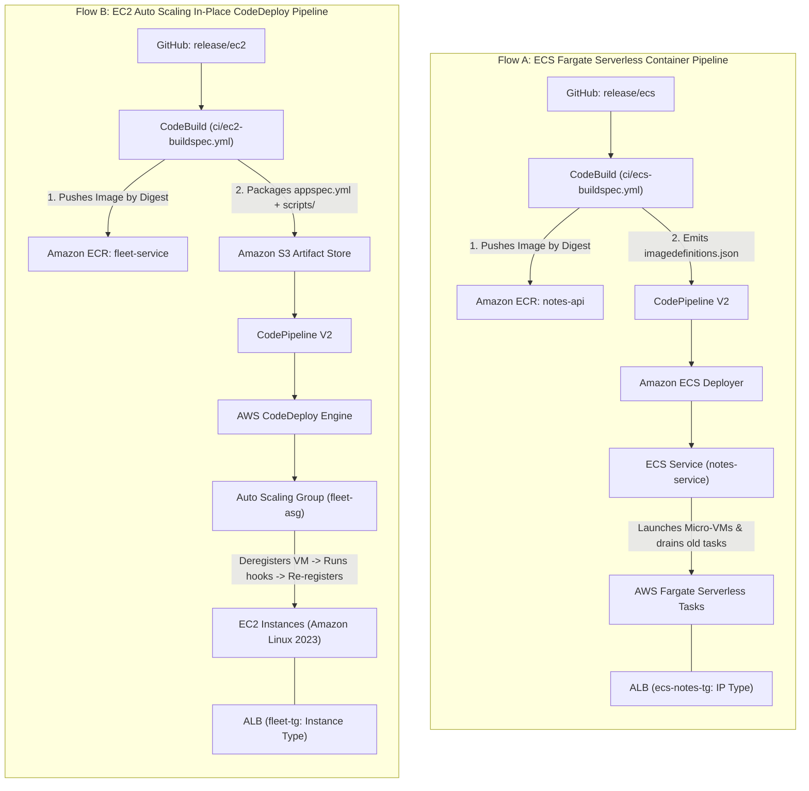

# Architectural Comparison: Flow A (ECS Fargate) vs. Flow B (EC2 Auto Scaling + CodeDeploy)
**AWS CI/CD Patterns | Autumn 2026 Edition**

---

## 1. Executive Summary & Visual Architecture

Both pipelines achieve **zero-downtime automated Continuous Deployment (CD)** from GitHub through AWS CodeBuild, Amazon ECR, and Application Load Balancers. However, they operate on fundamentally different compute paradigms, deployment controllers, and artifact contracts.



---

## 2. Comprehensive Comparison Matrix

| Dimension | **Flow A: ECS Fargate** | **Flow B: EC2 Auto Scaling + CodeDeploy** |
| :--- | :--- | :--- |
| **Compute Model** | **Serverless Container Engine** (Micro-VMs provisioned and patched by AWS on demand). | **Self-Managed VM Fleet** (Dedicated Amazon EC2 instances managed by an Auto Scaling Group). |
| **GitHub Release Branch** | `release/ecs` | `release/ec2` |
| **CodeBuild Spec** | `ci/ecs-buildspec.yml` | `ci/ec2-buildspec.yml` |
| **Build Output Artifact** | A single JSON file: `imagedefinitions.json`. | An S3 revision bundle: `appspec.yml`, `scripts/start.sh`, `scripts/health.sh`, `release-image.txt`. |
| **Deployment Provider** | **Amazon ECS (standard)** (Built-in CodePipeline provider). | **AWS CodeDeploy** (`EC2/On-premises` in-place provider). |
| **Who Pulls from ECR?** | AWS Fargate infrastructure via `ecsTaskExecutionRole`. | The EC2 instance via `scripts/start.sh` using `fleet-ec2-instance-role`. |
| **ALB Target Group Type** | **`IP` Target Type** (Each Fargate task gets an Elastic Network Interface / IP address). | **`Instance` Target Type** (Targeted directly by EC2 Instance IDs). |
| **Traffic Shifting Method** | ECS launches new tasks, waits for healthy `/health`, routes traffic, and drains old tasks. | CodeDeploy deregisters 1 instance at a time from ALB, runs hooks, verifies `/health`, and re-registers. |
| **Rollback Mechanism** | **ECS Deployment Circuit Breaker** (Auto-reverts to previous active Task Definition revision). | **CodeDeploy Auto-Rollback** (Redeploys the last known good S3 bundle upon script error or alarm). |
| **Host OS & Patching** | **Zero OS management**. AWS patches the underlying host, container runtime, and security layer. | **User-managed**. You must update packages via `dnf`, rotate Launch Template AMIs, and update agents. |
| **Billing Model** | Pay **per-second** for exact vCPU/RAM requested by running tasks. Zero cost when scaled to 0. | Pay for **running EC2 instances 24/7**, regardless of whether CPU utilization is 5% or 95%. |
| **Startup / Scaling Speed** | Fast (~30 to 60 seconds to pull image and launch task). | Slower (~2 to 4 minutes to launch VM, run User Data, install Docker, and boot container). |

---

## 3. Deep Dive: Flow A (ECS Fargate)

### How It Works:
1. **Developer pushes to `release/ecs`**.
2. **CodeBuild** tests the code (`npm test`), builds the Docker container, pushes it to Amazon ECR (`notes-api`), queries the immutable SHA-256 digest (`@sha256:...`), and emits `imagedefinitions.json`.
3. **CodePipeline** passes `imagedefinitions.json` to the ECS deployment provider.
4. **ECS** updates the Task Definition, provisions 2 new serverless Fargate tasks, registers their private IPs into `ecs-notes-tg`, and tests `/health`.
5. Once healthy, the ALB shifts traffic to the new tasks, and ECS terminates the old tasks with zero downtime.

### Strengths:
* **Zero Host Maintenance**: No Linux OS patching, no kernel CVE management, no AMI baking.
* **Granular Resource Allocation**: Request exactly `0.25 vCPU` and `0.5 GB RAM` per task.
* **Clean Artifact Contract**: Only requires a small JSON file; no deployment scripts to maintain on servers.
* **Rapid Scale-Out**: New tasks start in seconds without waiting for a full VM boot cycle.

### When to Use:
* Modern microservices, REST APIs, web apps, and background queue workers.
* Teams that want minimal operational overhead and want AWS to manage hardware and OS security.

---

## 4. Deep Dive: Flow B (EC2 Auto Scaling + CodeDeploy)

### How It Works:
1. **Developer pushes to `release/ec2`**.
2. **CodeBuild** tests the code (`npm test`), builds the Docker container, pushes it to Amazon ECR (`fleet-service`), and packages `appspec.yml`, `scripts/start.sh`, `scripts/health.sh`, and `release-image.txt` into an S3 bundle.
3. **CodePipeline** triggers **AWS CodeDeploy** against the Auto Scaling Group (`fleet-asg`).
4. **CodeDeploy** executes a `OneAtATime` rolling update:
   - **Step 1 (BlockTraffic)**: Deregisters Instance 1 from `fleet-alb`.
   - **Step 2 (ApplicationStart)**: Runs `scripts/start.sh` on Instance 1 to pull the pinned digest and restart Docker.
   - **Step 3 (ValidateService)**: Runs `scripts/health.sh` to test `http://127.0.0.1:3000/health`.
   - **Step 4 (AllowTraffic)**: Re-registers Instance 1 to `fleet-alb` and waits for healthy status.
   - **Step 5**: Repeats the exact same sequence for Instance 2.

### Strengths:
* **Complete Host Control**: Full root/SSH access to the underlying virtual machines via SSM Session Manager.
* **Custom Host Daemons & Drivers**: Ability to run custom security agents, log forwarders, GPU drivers, or local caching daemons directly on the VM.
* **Predictable Cost at High Steady-State Volume**: For large, constant 24/7 workloads, Reserved Instances / Savings Plans on EC2 can provide bulk compute discounts.
* **Direct Hardware Access**: Support for local high-speed NVMe instance storage.

### When to Use:
* Legacy application migrations requiring specific OS tuning, specialized hardware, or host-level file storage.
* Workloads requiring persistent host-level background services, monitoring agents, or custom network kernel modules.

---

## 5. Architectural Decision Guide

```text
Do you need direct root access to the underlying Linux host,
custom kernel modules, or host-mounted hardware?
   │
   ├──► YES ──► Choose FLOW B (EC2 Auto Scaling + CodeDeploy)
   │            • Host control
   │            • Custom systemd services & agents
   │            • In-place VM rolling updates
   │
   └──► NO  ──► Choose FLOW A (ECS Fargate Serverless)
                • Recommended default for modern cloud applications
                • Zero server patching or AMI maintenance
                • Clean JSON image deployment contract
                • True pay-per-second serverless scaling
```

---

## 6. Summary Comparison Table

| Metric | Flow A (ECS Fargate) | Flow B (EC2 Auto Scaling) |
| :--- | :--- | :--- |
| **Operational Complexity** | **Low** (Serverless) | **Medium-High** (Host management) |
| **Deployment Speed** | **Fast** | **Moderate** |
| **Host Access (SSH/Root)** | No (Container-level only via ECS Exec) | Yes (Full root via SSM Session Manager) |
| **Underlying OS** | Managed by AWS | Amazon Linux 2023 (AL2023) |
| **Deployment Mechanism** | Rolling container replacement | In-place script hooks (`ApplicationStart`, `ValidateService`) |
| **Recommended Choice** | **Default for 95% of modern apps** | **Specialized / Legacy / Host-dependent workloads** |
